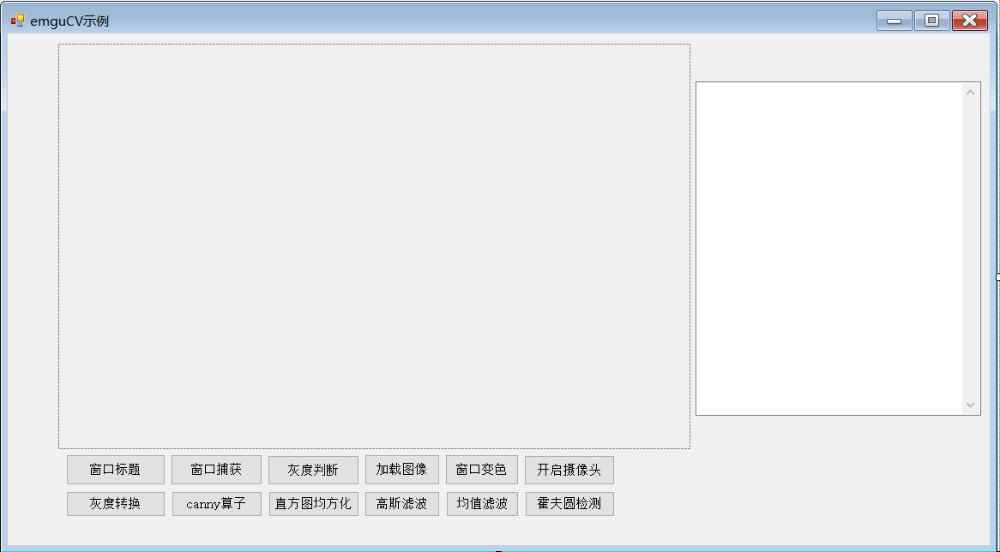

# emguCV_DEMO
This project will configure the EmguCV environment within Visual Studio and implement several small demos through the established setup. A user manual has been created that provides detailed step-by-step instructions, along with solutions to common troubleshooting issues.The demos include common image processing examples, camera integration, Gaussian filtering, mean filtering, and more.  

 本项目将在visual studio中配置emguCV环境，并通过搭载的环境实现几个小demo，编写了用户手册，手册中对步骤有详细的描述，以及常见的报错处理。小demo有常见的图像处理示例，摄像头调用，高斯滤波，均值滤波等。  

 This project was implemented under Visual Studio 2022, utilizing EmguCV version 4.2.0. The targeted framework is .NET Framework 4.8.

 本项目是在visual studio 2022下实现的，安装的emguCV版本为4.2.0，所用的目标框架为.NET Framework 4.8

This project has created a Windows Forms application within Visual Studio, offering a variety of processing methods encapsulated within separate controls. The interface of the form can be referred to in the image below.For detailed program instructions, please refer to the user manual located in the same directory.

本项目在visual studio中创建了一个窗体应用程序，提供了多种处理方法，并将其封装在了单独的控件上，窗体的界面可参考下图。 程序详细说明请参考同级目录下的用户手册。 

